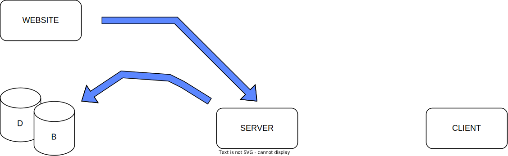
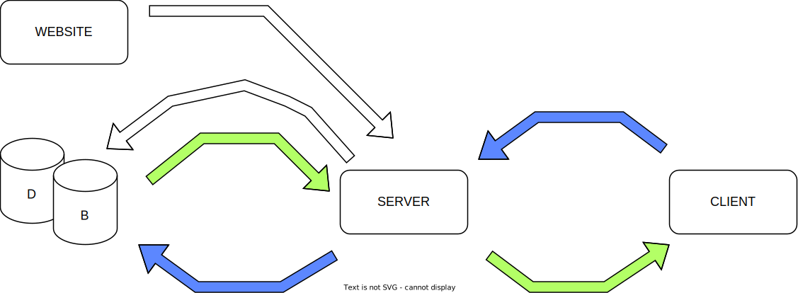
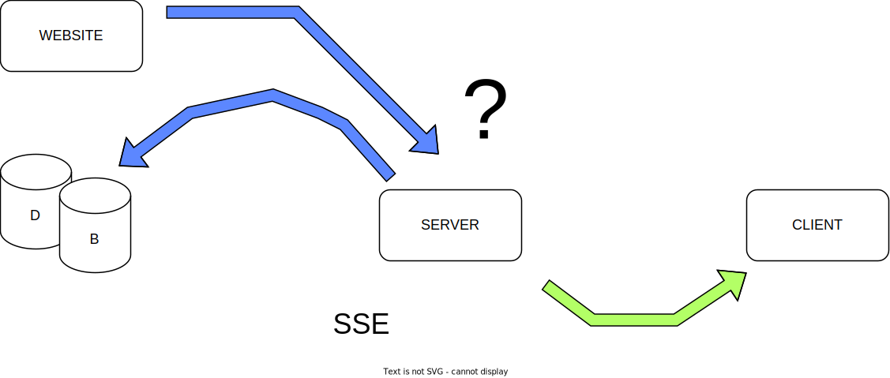
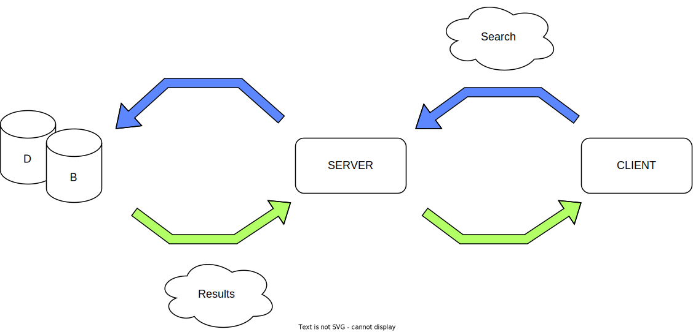

# DarkWeb

## Stage 1
### 1. Scraping and processing the fetched data 
### 2. Make data analysis 
### 3. Save into the DB

## Stage 2
### 1. Asking **relevant** data from the server
### 2. Opening event-stream (for the SSE) 
### 3. (Stage 1 keep running)

## Stage 3
### 1. (Stage 1 keep running) 
### 2. If new data recived send it to Client 
### 3. Make data analysis
### 4. Save the new Data into the DB

## Stage 4
### 1. Client use search-bar
### 2. Fetch omni-field query from DB 
### 3. Client-side make self analysis on filtered data

